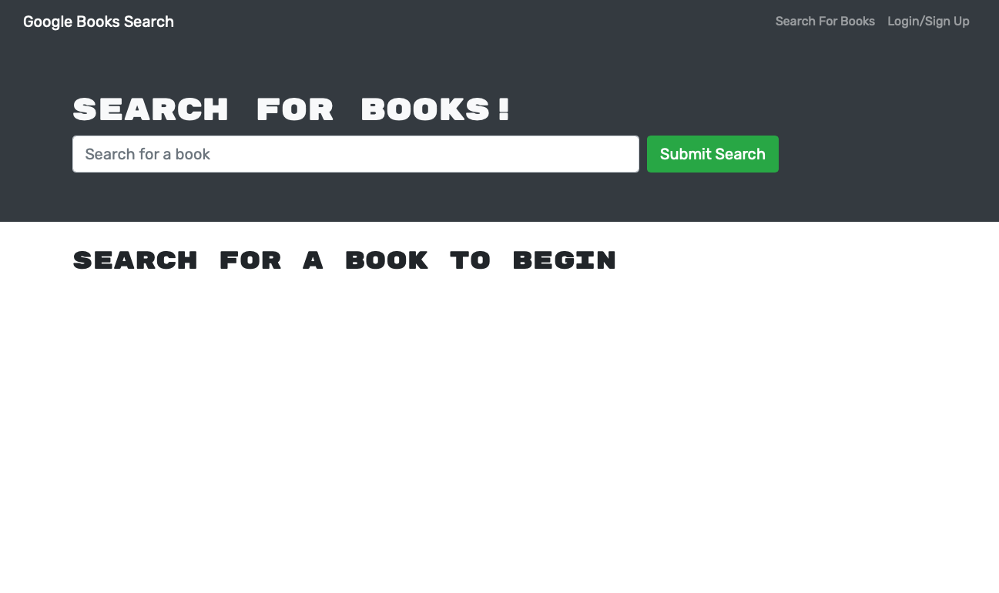

# Book Search Engine 

## Description
This book search engine utilizes Google Books API, was built using the MERN stack with a React front end, MongoDB database, and Node.js/Express.js server and API.

## Table of Contents
- [Installation](#installation)
- [Usage](#usage)
- [Link](#link)
- [Contribute](#contribute)

- [Questions](#questions)

## Installation
Online: Go to [YWK's Book Search Engine @ Heroku](https://ywk-book-search-engine.herokuapp.com) to run the application. 

Local: Must have MongoDB installed locally! Run "npm i" to install dependencies. Enter ”npm run build“ to build the application and “nom start” to start the application on localhost:3000.

## Usage
This application allows avid reader to search for new books to read and keep a list of books to purchase.

## Link
[YWK's Book Search Engine @ Heroku](https://ywk-book-search-engine.herokuapp.com)

## Contribute
If you would like to contribute, please feel free to contact me by email.

## Questions
GitHub: [ywkuo227's GitHub](https://github.com/ywkuo227)

Email: [ywkuo@outlook.com](mailto:ywkuo@outlook.com)